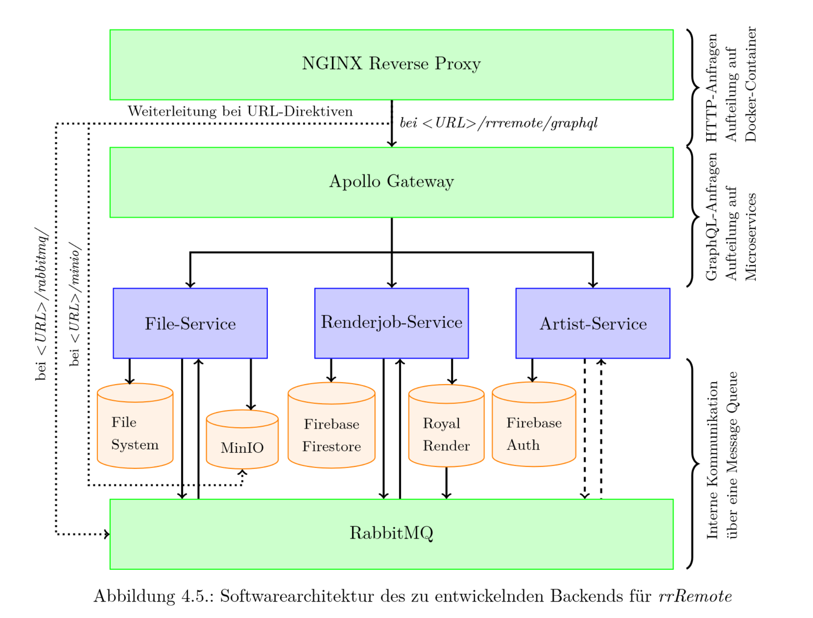

⚠️ This Repository is just a reference for what i did as a project in my bachelor thesis. Therefore it has been archived immediately.⚠️

Since Royal Render dropped its support for NodeJS with the release of Royal Render 9, this Project is EOL anyway so i'm fine with setting this public. If you have any questions or interest regarding this, feel free to contact me 😊. You can read my Bachelor which is called `thesis.pdf` in this directory, which was written in German.

Every folder in this Repo represents a former GitLab Repository that was used to create a Microservice for the rrRemote project. I deleted files with credentials but left the corresponding `gitlab-ci.yml` files for the Continous Deployment in the projects.

The International Film School in Cologne (IFS) teaches students in the arts of movie creation.
This also includes heavy computational workloads regarding rendering 3D-VFX scenes that need to be composited onto recorded film footage. The Hamm-Lippstadt University of applied Sciences (HSHL) has more potential rendernodes than the IFS which can be used with a tool called Royal Render (RR). RR takes 3D scenes of e.g. Autodesk Maya, chunks the range of frames which should be rendered and distributes these renderable chunks to different rendernodes in the network.

The software architecture was developed with Domain-Driven-Design (DDD) which resulted in the architecture of rrRemote you can see in the image below. In the perspective of the `Renderjob-Service` Royal Render has been used as a form of Database from which it could fetch information about active or former Renderjobs. The `File-Service` was there to manage local files and renderjob projects in different Databases (mainly file system and MinIO as an upload interface for external access). The `Artist-Service` was mainly there for user management, which is why it only has a loose connection to the RabbitMQ driven inter-service communication.

The system worked quite well but besides a few bugs the system had, there were some problems which could be identified which might be
interesting for future thesis or papers:

* The amount of data which has to be sent over the network is immense. One Alembic cache for a small project already had a size of >50 GB. Also TCP connections sometimes dropped and the upload was canceled immediately. It would be interesting to see how these amounts of data could be streamed to such a system in an efficient and reliable way.
* There are tools like [Sheepit Renderfarm](https://www.sheepit-renderfarm.com/home) which registers your computer into a blob of potential render nodes for blender projects. rrRemote was conidered to be a project for sharing computational ressources for between universities that need to render VFX. A system that is getting installed at different organizations which will form a rendernode-cloud with all locally available ressources and a distribution of the computation between organizations could be interesting as well.